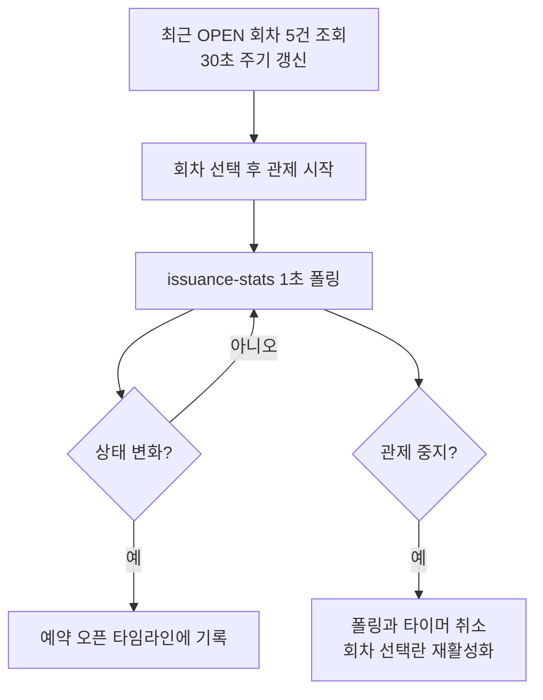
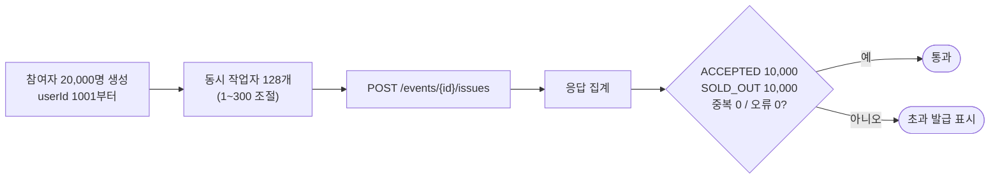
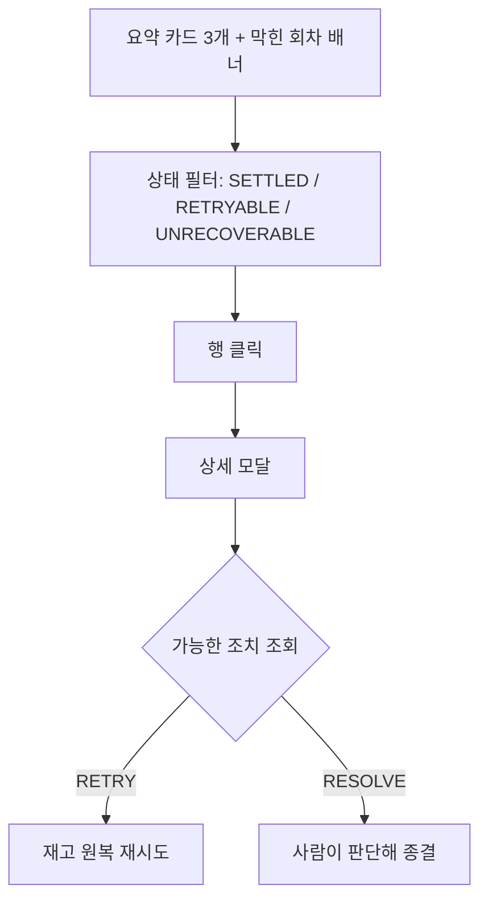
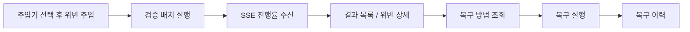

# Ace_FE

**선착순 쿠폰 발급 시스템의 운영 관리자 대시보드**입니다.
회차 생성부터 정오 트래픽 재현, 발급 실패 조치, 300만 건 정합성 검증까지를 한 화면에서 진행합니다.


> LG U+ 프리덤 데이를 소재로 한 교육용 가상 시나리오이며 실제 서비스와 무관합니다.

---

## 프로젝트 개요

**백엔드가 "동시 20,000명에도 초과 발급 0건"을 보장한다는 주장을, 화면에서 직접 눌러 확인시키는 것이 목적입니다.**

[`Ace_BE`](https://github.com/URECA-Ace/Ace_BE)의 동작 대부분은 눈에 보이지 않습니다.
재고는 Redis 안에서만 움직이고, 저장은 요청 밖에서 일어나며, 정합성 위반은 300만 건을 다 훑어야 나옵니다.
이걸 로그와 DB 쿼리로만 확인하면 팀 안에서도 검증이 안 되고, 밖에서는 더더욱 안 됩니다.

그래서 이 화면은 조회 도구가 아니라 **검증 도구**로 만들었습니다.
20,000명 트래픽을 브라우저에서 실제로 발생시키고, 정합성 위반을 일부러 주입해 검사기가 잡는지 확인하고,
발급 실패를 재시도하거나 종결하는 조치까지 화면에서 끝냅니다.

**서버가 주지 않는 값은 화면에서 만들지 않는다**를 원칙으로 삼았습니다.
예약 오픈 카운트다운을 프론트에서 임의로 만들지 않고, 대응 API가 없는 버튼은 잘못된 성공 상태를 만들지 않도록 비활성 상태로 둡니다.

## 팀 구성

2026.08.06 ~ 08.31 동안 [`Ace_BE`](https://github.com/URECA-Ace/Ace_BE) 팀 6명 중 5명이 참여했습니다.
백엔드 담당 도메인과 화면을 짝지어, 각자 만든 API를 각자 화면에 붙이는 방식으로 나눴습니다.

|  |  |  |  |  |
|:---:|:---:|:---:|:---:|:---:|
| [@ch0rca](https://github.com/ch0rca) | [@gart09](https://github.com/gart09) | [@jimizip](https://github.com/jimizip) | [@jungchoib](https://github.com/jungchoib) | [@woolimbyun](https://github.com/woolimbyun) |

## 기술 스택

| 구분 | 기술 | 선택 이유 |
|---|---|---|
| Language | JavaScript (ES2022) | |
| Library | React 19 | |
| Build | Vite 8 | 개발 서버 프록시로 CORS 설정 없이 백엔드에 붙습니다. `VITE_API_TARGET`만 바꾸면 로컬과 AWS를 오갈 수 있습니다 |
| 실시간 수신 | `EventSource` (SSE) | 서버에서 클라이언트로 흐르는 단방향 알림뿐이라 WebSocket까지 갈 이유가 없었습니다. 연결이 끊기면 브라우저가 알아서 재연결합니다 |
| 상태 보관 | `localStorage` | 시연 중 새로고침해도 선택한 회차와 발급 이력이 남아야 했습니다. 서버가 보관할 성격의 데이터가 아닙니다 |
| 메트릭 | Grafana 패널 임베드 (`d-solo`) | 시계열 차트를 직접 만들면 백엔드가 이미 내보내는 Prometheus 지표를 두 번 구현하게 됩니다 |
| 상태 관리 | 없음 (React 내장 훅) | 화면 5개가 각자 독립적이고 공유 상태는 선택한 회차 정도입니다. 라이브러리를 넣을 만한 복잡도가 아니었습니다 |

## 화면

사이드바 메뉴 5개로 나뉩니다.

| 메뉴 | 하는 일 |
|---|---|
| **발급 운영** | 실시간 발급 현황 관제, 예약 오픈 타임라인, 멱등성 동시 요청 테스트 |
| **쿠폰 관리** | 쿠폰과 발급 회차 생성, 회차 목록 조회 |
| **발급 실패** | DLQ 조회, 재시도, 종결 조치 |
| **정합성 리포트** | 검증 배치 실행, 위반 조회, 복구, 위반 주입 |
| **테스트** | 20,000명 선착순 트래픽 시뮬레이션 |

### 1. 실시간 발급 현황 관제

재고가 Redis 안에서만 움직이므로, DB를 조회해서는 발급이 진행되는 모습을 볼 수 없습니다.
그래서 Redis 기반 현황 API를 1초 간격으로 폴링합니다.



- **프론트에서 카운트다운을 만들지 않습니다.** 현황 API에 예약 오픈 시각이 포함되지 않으므로, 백엔드 스케줄러가 상태를 `OPEN`으로 바꾸고 그것이 Redis 현황에 관측되는 시점만 화면에 반영합니다. 화면이 만든 시각과 서버가 아는 시각이 어긋나면 시연이 거짓말이 됩니다
- 존재하지 않는 캠페인과 `EVENT_STATS_TEMPORARILY_UNAVAILABLE`을 구분해 표시합니다. 후자는 쓰기 경로와의 레이스로 잠깐 조회가 거부되는 상태이지 장애가 아닙니다

### 2. 선착순 트래픽 시뮬레이션

"20,000명이 몰려도 10,000장만 나간다"를 말로 설명하는 대신 눌러서 보게 만들었습니다.
브라우저에서 실제 HTTP 요청 20,000건을 발생시키고 응답을 집계합니다.



- **20,000명의 개별 결과를 저장하지 않고 집계만 유지합니다.** 브라우저 메모리와 `localStorage` 용량을 지키기 위해서이고, 개별 이력은 단건 발급 테스트에서만 남깁니다
- 화면에 표시되는 requests/sec는 **브라우저부터 API까지의 클라이언트 관측값**입니다. 서버 성능 지표가 아니므로 [`Ace_LT`](https://github.com/URECA-Ace/Ace_LT)의 k6 측정치와 같은 값으로 읽으면 안 된다고 화면에 명시했습니다

### 3. 발급 실패 관제 (DLQ)

저장이나 확정에 실패한 건은 재고가 묶여 있을 수 있어, 운영자가 보고 조치해야 합니다.



- **화면은 폴링하지 않습니다.** 자동 복구 스케줄러의 결과를 보려면 새로고침 버튼을 눌러야 합니다. 실패 목록은 초 단위로 변하는 값이 아니고, 조치 중에 목록이 바뀌면 오히려 오조작을 부릅니다
- 조치 버튼은 서버가 내려주는 가능한 조치 목록에 따라 켜지고 꺼집니다. 프론트가 상태별 조치를 따로 판정하면 백엔드와 기준이 갈라집니다

### 4. 정합성 리포트와 위반 주입

검사기가 위반을 잡는지 확인하려면 위반이 있는 데이터가 필요합니다.
그래서 화면에서 **위반을 일부러 주입하고 검증 배치를 돌려** 잡히는지 확인합니다.



- 배치는 300만 건을 훑으므로 오래 걸립니다. 그래서 진행률을 **SSE로 밀어 받고**, 화면을 벗어나거나 새로고침해도 진행 중인 배치를 `localStorage`의 `jobExecutionId`로 다시 붙습니다
- 배치 상태 배너는 완료 후 5초 뒤 사라집니다. 중단 버튼으로 실행 중인 배치를 멈출 수 있습니다

### 5. 실시간 알림

발급 성공과 실패, 검증 배치의 시작과 단계 완료, 스케줄러 실행이 SSE 한 스트림으로 들어옵니다.

- 하트비트는 SSE 주석 라인이라 `EventSource`가 이벤트로 전달하지 않으므로 별도 필터링이 필요 없습니다
- JSON이 아닌 메시지는 무시하고, 연결이 끊기면 브라우저의 자동 재연결에 맡깁니다

## 연동 API

백엔드 계약은 [`Ace_BE`](https://github.com/URECA-Ace/Ace_BE)의 `develop` 기준입니다.

<details>
<summary>엔드포인트 펼쳐보기</summary>

**발급**

| Method | Path | 쓰는 화면 |
|---|---|---|
| POST | `/api/v1/events/{eventId}/issues` | 발급 운영, 테스트 |
| GET | `/api/v1/events/{eventId}/issues/{requestId}` | 발급 운영 |
| GET | `/api/v1/events/{eventId}/issuance-stats` | 발급 운영 |
| GET | `/api/v1/events/{eventId}/issuance-logs` | 발급 운영 |
| GET | `/api/v1/events/recent` | 전 화면 (회차 선택) |
| PATCH | `/api/v1/events/{eventId}/close` | 쿠폰 관리 |

**쿠폰과 캠페인**

| Method | Path | 쓰는 화면 |
|---|---|---|
| GET | `/api/v1/coupons` | 쿠폰 관리 |
| POST | `/api/v1/coupons` | 쿠폰 관리 |
| POST | `/api/v1/coupons/{couponId}/events` | 쿠폰 관리 |

**발급 실패 (DLQ)**

| Method | Path | 쓰는 화면 |
|---|---|---|
| GET | `/api/v1/issue-failures` | 발급 실패 |
| GET | `/api/v1/issue-failures/summary` | 발급 실패 |
| GET | `/api/v1/issue-failures/{failureId}` | 발급 실패 |
| GET | `/api/v1/issue-failures/{failureId}/actions` | 발급 실패 |
| POST | `/api/v1/issue-failures/{failureId}/actions/{action}` | 발급 실패 |

**정합성 검증**

| Method | Path | 쓰는 화면 |
|---|---|---|
| GET | `/api/v1/consistency/checks` | 정합성 리포트 |
| POST | `/api/v1/consistency/verifications` | 정합성 리포트 |
| GET | `/api/v1/consistency/verifications/{jobExecutionId}` | 정합성 리포트 |
| POST | `/api/v1/consistency/verifications/{jobExecutionId}/stop` | 정합성 리포트 |
| GET | `/api/v1/consistency/results` | 정합성 리포트 |
| GET | `/api/v1/consistency/results/{resultId}/violations` | 정합성 리포트 |
| GET | `/api/v1/consistency/results/{resultId}/recovery-methods` | 정합성 리포트 |
| POST | `/api/v1/consistency/results/{resultId}/recoveries` | 정합성 리포트 |
| GET | `/api/v1/consistency/recoveries` | 정합성 리포트 |
| GET | `/api/v1/consistency/schedules` | 정합성 리포트 |
| PATCH | `/api/v1/consistency/schedules/{schedulerName}` | 정합성 리포트 |
| GET | `/api/v1/consistency/injectors` | 정합성 리포트 |
| POST | `/api/v1/consistency/injections` | 정합성 리포트 |

**알림**

| Method | Path | 쓰는 화면 |
|---|---|---|
| GET | `/api/v1/notifications/stream` | 전 화면 (토스트) |

</details>

---

<details>
<summary>실행 방법</summary>

**요구 사항**: Node.js 20.19 이상 (Vite 8 요구 사항), 기동 중인 [`Ace_BE`](https://github.com/URECA-Ace/Ace_BE)

**먼저 알아야 할 것**

| 항목 | 상태 | 조치 |
|---|---|---|
| `.env` | 저장소에 없음 (`.gitignore`) | `.env.example`을 복사합니다. 개발 서버만 쓸 거면 없어도 기본값으로 동작합니다 |
| 백엔드 | 별도 저장소 | `Ace_BE`를 먼저 띄워야 화면이 데이터를 받습니다 |
| Grafana 패널 | 선택 | 없으면 메트릭 카드만 비고 나머지 화면은 정상 동작합니다 |

```bash
npm install
npm run dev          # http://localhost:5173
```

개발 서버는 `/api`와 `/internal` 요청을 `VITE_API_TARGET`(기본 `http://localhost:8080`)으로 프록시합니다.

**환경 변수**

| 변수 | 기본값 | 용도 |
|---|---|---|
| `VITE_API_TARGET` | `http://localhost:8080` | 개발 서버 프록시 대상 |
| `VITE_API_BASE_URL` | (비움) | 브라우저에서 백엔드로 직접 호출하는 배포 환경에서 지정합니다. 프록시를 쓰면 비워 둡니다 |
| `VITE_GRAFANA_URL` | `http://localhost:3000` | 각 탭에 임베드하는 Grafana 패널(`d-solo`) 주소 |

**검증**

```bash
npm run lint
npm run build
```

</details>
